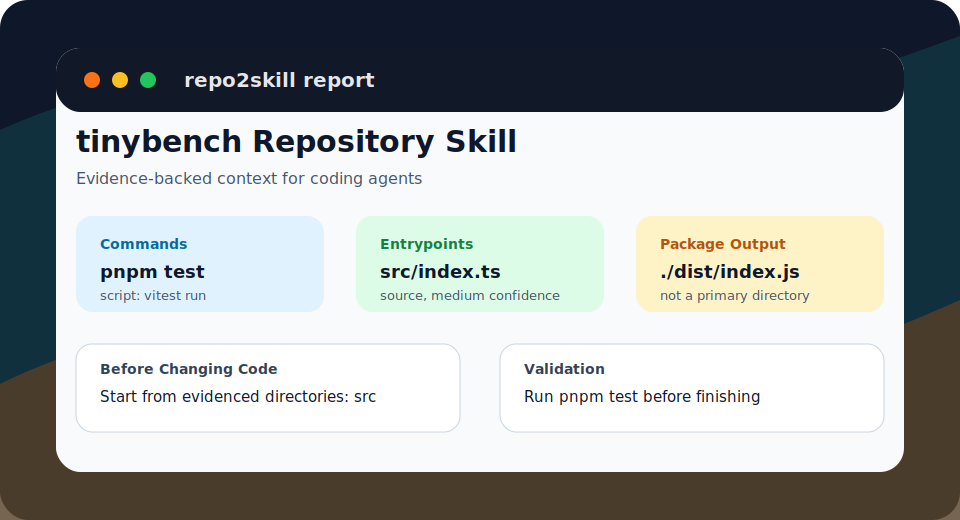

# repo2skill

> Turn any repository into agent-ready onboarding context.


[](https://www.typescriptlang.org/)
[](./LICENSE)

**语言 / Language:** [简体中文](#简体中文) | [English](#english)

```bash
npm run dev -- https://github.com/tinylibs/tinybench --no-cache --out ./out-tinybench
```

```txt
Input repository
  -> repo2skill.json
  -> project-map.md
  -> AGENTS.md
  -> SKILL.md
  -> quickstart.windows.md / quickstart.macos.md / quickstart.linux.md
  -> report.html
```

[View tinybench demo](./docs/demo-tinybench.md) · [Release checklist](./docs/release-checklist.md) · [Quality checks](./docs/quality-checks.md)



---

## 简体中文

`repo2skill` 会分析本地仓库或公开 GitHub 仓库，把真实仓库证据转换成 coding agent 可以直接使用的 onboarding 产物。

它不是再写一份泛泛的项目说明，而是生成可执行、可追溯、适合交给 agent 的上下文：命令、入口文件、关键配置、重要目录、环境变量线索、验证步骤，以及专用 `SKILL.md`。

### 适合什么场景

- 你想把一个陌生仓库快速交给 Codex、Claude Code 或其他 coding agent。
- 你想生成一份可提交的 `AGENTS.md`，告诉 agent 修改前应该看哪里、完成前应该跑什么。
- 你想把公开 GitHub 仓库变成可复用的 repository skill。
- 你想用 benchmark 防止仓库分析能力回退。

### 快速开始

安装依赖：

```bash
npm install
```

分析一个公开 GitHub 仓库：

```bash
npm run dev -- https://github.com/tinylibs/tinybench --no-cache --out ./out-tinybench
```

分析本地 fixture：

```bash
npm run dev -- ./tests/fixtures/analysis-target --out ./out
```

只打印摘要，不写文件：

```bash
npm run dev -- ./tests/fixtures/analysis-target --summary-only
```

### 会生成什么

| 文件 | 用途 |
| --- | --- |
| `repo2skill.json` | 结构化分析结果，供工具链继续处理 |
| `project-map.md` | 简洁的仓库地图 |
| `AGENTS.md` | 给 coding agent 的仓库级工作说明 |
| `SKILL.md` | 可复制给 agent 使用的 repository skill |
| `quickstart.windows.md` | Windows 快速开始 |
| `quickstart.macos.md` | macOS 快速开始 |
| `quickstart.linux.md` | Linux 快速开始 |
| `report.html` | `--format all` 时生成的 HTML 报告 |

### 输出示例

视觉预览见 [report preview](./docs/assets/report-preview.svg)。真实仓库验证见 [tinybench demo](./docs/demo-tinybench.md)。

`AGENTS.md` 会给出清晰的修改前导航和验证指令：

```md
## Before Changing Code

- Review relevant config first: `package.json`, `vitest.config.ts`.
- Start from evidenced directories: `src`.

## Validation Before Finishing

- Run only the evidenced validation commands that are relevant to your change.
- Run `pnpm test` for the `test` command.
```

`SKILL.md` 会保留证据来源，包括源码入口和发布产物入口的区别：

```md
## References

- Config: `vitest.config.ts` (test, high)
- Entrypoint: `./dist/index.js` (package-output, high, main)
- Entrypoint: `src/index.ts` (source, medium)
- Directory: `src` (source, medium)
```

完整示例见 [examples/analysis-target](./examples/analysis-target)。

### 当前可检测内容

- 包管理器：来自 lockfile。
- 项目类型：来自框架配置、依赖和 CLI 信号。
- 命令：来自 `package.json` scripts，并渲染为 `pnpm test`、`npm run build` 等可执行命令。
- 入口文件：区分 `source`、`package-output`、`cli`、`generated` 等角色。
- 工作区：检测 `pnpm-workspace.yaml`、`package.json workspaces`、`turbo.json`、`nx.json` 等信号。
- 重要目录：来自源码入口和 workspace globs，不会把 `dist` 当作优先导航目录。
- 关键配置：例如 `tsconfig`、Vite、Next.js、ESLint、Prettier、Vitest、GitHub Actions、Dockerfile。
- 环境变量：来自 `.env.example`、`.env.local.example` 和源码里的 `process.env.*`。

### 常用命令

分析指定 GitHub 分支：

```bash
npm run dev -- https://github.com/octocat/Hello-World --branch master --out ./out-github
```

刷新缓存后分析：

```bash
npm run dev -- https://github.com/octocat/Hello-World --refresh --out ./out-github
```

使用临时 clone，分析后删除：

```bash
npm run dev -- https://github.com/octocat/Hello-World --no-cache --out ./out-github
```

运行 benchmark：

```bash
npm run benchmark -- ./benchmarks/public-node-ts-smoke.json --cache-dir E:/r2s-cache --out ./benchmark-smoke-out
```

写入 benchmark baseline：

```bash
npm run benchmark -- ./benchmarks/public-node-ts-smoke.json --cache-dir E:/r2s-cache --out ./benchmark-smoke-out --baseline-out ./benchmarks/baselines/public-node-ts-smoke.summary.json
```

对比已有 baseline：

```bash
npm run benchmark -- ./benchmarks/public-node-ts-smoke.json --cache-dir E:/r2s-cache --out ./benchmark-smoke-out --compare ./benchmarks/baselines/public-node-ts-smoke.summary.json
```

### 开发验证

```bash
npm run lint
npm run typecheck
npm test
npm run build
```

### 设计原则

- 只收集有证据的事实，不生成脑补命令。
- detector 负责收集事实，exporter 负责渲染产物。
- 所有产物来自同一个结构化分析对象，避免文档之间互相矛盾。
- benchmark 保护核心能力，防止回归。

### 当前范围

已支持：

- 本地仓库和公开 GitHub 仓库。
- 以 Node.js / TypeScript 为主的项目。
- `json`、`md`、`all` 导出模式。
- GitHub clone 缓存、`--refresh`、`--no-cache`。
- smoke/full benchmark baseline 和 regression compare。

暂不支持：

- 私有仓库鉴权。
- 广泛多语言仓库的深度语义分析。

[Back to top](#repo2skill)

---

## English

`repo2skill` analyzes a local repository or public GitHub repository and turns real repository evidence into onboarding artifacts that coding agents can use immediately.

It does not write another generic project summary. It produces executable, traceable context for agents: commands, entrypoints, key config files, important directories, environment-variable hints, validation steps, and a repository-specific `SKILL.md`.

### When to use it

- You want to hand an unfamiliar repository to Codex, Claude Code, or another coding agent.
- You want a committed `AGENTS.md` that tells agents where to look before editing and what to run before finishing.
- You want to turn a public GitHub repository into a reusable repository skill.
- You want benchmark coverage that catches regressions in repository analysis quality.

### Quick start

Install dependencies:

```bash
npm install
```

Analyze a public GitHub repository:

```bash
npm run dev -- https://github.com/tinylibs/tinybench --no-cache --out ./out-tinybench
```

Analyze the included local fixture:

```bash
npm run dev -- ./tests/fixtures/analysis-target --out ./out
```

Print a summary without writing files:

```bash
npm run dev -- ./tests/fixtures/analysis-target --summary-only
```

### Generated artifacts

| File | Purpose |
| --- | --- |
| `repo2skill.json` | Structured analysis for downstream tooling |
| `project-map.md` | Concise repository map |
| `AGENTS.md` | Repository-level instructions for coding agents |
| `SKILL.md` | Repository skill that can be copied into an agent session |
| `quickstart.windows.md` | Windows quickstart |
| `quickstart.macos.md` | macOS quickstart |
| `quickstart.linux.md` | Linux quickstart |
| `report.html` | HTML report generated with `--format all` |

### Output preview

See the [report preview](./docs/assets/report-preview.svg) for the visual summary, and the [tinybench demo](./docs/demo-tinybench.md) for a real repository check.

`AGENTS.md` gives clear pre-change navigation and validation guidance:

```md
## Before Changing Code

- Review relevant config first: `package.json`, `vitest.config.ts`.
- Start from evidenced directories: `src`.

## Validation Before Finishing

- Run only the evidenced validation commands that are relevant to your change.
- Run `pnpm test` for the `test` command.
```

`SKILL.md` preserves evidence, including the difference between source entrypoints and package output entrypoints:

```md
## References

- Config: `vitest.config.ts` (test, high)
- Entrypoint: `./dist/index.js` (package-output, high, main)
- Entrypoint: `src/index.ts` (source, medium)
- Directory: `src` (source, medium)
```

See [examples/analysis-target](./examples/analysis-target) for committed sample output.

### What it detects today

- Package manager from lockfiles.
- Project type from framework config, dependencies, and CLI signals.
- Commands from `package.json` scripts, rendered as executable commands such as `pnpm test` or `npm run build`.
- Entrypoints with roles such as `source`, `package-output`, `cli`, and `generated`.
- Workspace signals such as `pnpm-workspace.yaml`, `package.json workspaces`, `turbo.json`, and `nx.json`.
- Important directories from source entrypoints and workspace globs, without treating `dist` as a priority navigation target.
- Key config files such as `tsconfig`, Vite, Next.js, ESLint, Prettier, Vitest, GitHub Actions, and Dockerfile.
- Environment variables from `.env.example`, `.env.local.example`, and `process.env.*` usage.

### Common commands

Analyze a specific GitHub branch:

```bash
npm run dev -- https://github.com/octocat/Hello-World --branch master --out ./out-github
```

Refresh the cache before analysis:

```bash
npm run dev -- https://github.com/octocat/Hello-World --refresh --out ./out-github
```

Use a temporary clone that is deleted after analysis:

```bash
npm run dev -- https://github.com/octocat/Hello-World --no-cache --out ./out-github
```

Run the benchmark manifest:

```bash
npm run benchmark -- ./benchmarks/public-node-ts-smoke.json --cache-dir E:/r2s-cache --out ./benchmark-smoke-out
```

Write a benchmark baseline:

```bash
npm run benchmark -- ./benchmarks/public-node-ts-smoke.json --cache-dir E:/r2s-cache --out ./benchmark-smoke-out --baseline-out ./benchmarks/baselines/public-node-ts-smoke.summary.json
```

Compare against an existing baseline:

```bash
npm run benchmark -- ./benchmarks/public-node-ts-smoke.json --cache-dir E:/r2s-cache --out ./benchmark-smoke-out --compare ./benchmarks/baselines/public-node-ts-smoke.summary.json
```

### Development

```bash
npm run lint
npm run typecheck
npm test
npm run build
```

### Design principles

- Collect evidence-backed facts only. Do not invent commands.
- Detectors collect facts. Exporters render artifacts.
- All artifacts derive from the same structured analysis object to avoid drift.
- Benchmarks protect core behavior from regressions.

### Current scope

Supported now:

- Local repositories and public GitHub repositories.
- Node.js / TypeScript-oriented projects.
- `json`, `md`, and `all` export modes.
- GitHub clone cache, `--refresh`, and `--no-cache`.
- Smoke/full benchmark baselines and regression comparison.

Not implemented yet:

- Private repository authentication.
- Deep semantic analysis for broad multi-language repositories.

[Back to top](#repo2skill)
