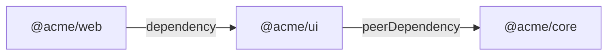

# repo2skill

> Deterministic preflight context compiler for Node.js/TypeScript repositories and monorepos.
>
> 面向 Node.js/TypeScript 仓库与 monorepo 的确定性开工检查与上下文编译器。


[](https://www.typescriptlang.org/)
[](./LICENSE)

**Current version / 当前版本：`v0.4.0`**

**Language / 语言：** [简体中文](#简体中文) | [English](#english)

`repo2skill` reads a local repository or a public GitHub repository and compiles evidence-backed files for coding agents. It detects real commands, entrypoints, configuration, workspace packages, package relationships, and validation scope without running target-repository scripts.

```text
Repository evidence
  -> repo2skill.json
  -> project-map.md
  -> AGENTS.md
  -> SKILL.md
  -> maintenance-profile.md
  -> quickstart.windows.md / quickstart.macos.md / quickstart.linux.md
  -> report.html
```

[Security model](./docs/security-model.md) | [Evaluation](./docs/evaluation.md) | [Benchmark plan](./docs/benchmark-plan.md) | [v0.4 release notes](./docs/release-v0.4.md)

---

## 简体中文

### 它解决什么问题

通用仓库摘要通常只回答“这个项目大概是什么”。`repo2skill` 更关注 coding agent 开工前真正需要的确定性事实：从哪里开始读代码、有哪些真实脚本、修改某个 workspace package 后该验证什么、哪些直接消费者可能受影响。

所有 JSON、Markdown 和 HTML 产物都消费同一个结构化分析对象。没有证据的内容会被省略，不会用泛化建议填充。

### v0.4 新增内容

v0.4.0 的主题是 **Monorepo Intelligence / Workspace Package Operational Graph**：

- 从 `pnpm-workspace.yaml`、`package.json` workspaces 数组或对象以及常规 `apps/*`、`packages/*` 目录发现真实 package；
- 支持 glob 排除、Windows 路径规范化、稳定排序，并忽略生成目录、缓存、缺少 `package.json` 的目录；
- 为每个 package 收集 metadata、脚本、命令、源码入口、发布产物入口、配置、重要目录、项目类型和安全的环境变量线索；
- 建立仅包含 workspace 内部包的直接 `dependency`、`devDependency`、`peerDependency`、`optionalDependency` 边；
- 计算每个包的直接依赖和直接消费者；
- 生成 pnpm、npm、Yarn 感知的包级命令；无法可靠生成 filter 时，保留 package `cwd` 并在三平台 quickstart 中安全渲染；
- 新增 `--package <name-or-path>` 聚焦分析；
- 扩展全部导出器、semantic evaluation 和 benchmark 指标。

### Workspace 示例

假设仓库包含：

```text
apps/web          @acme/web
packages/core     @acme/core
packages/ui       @acme/ui
```

且 `@acme/web` 依赖 `@acme/ui`，`@acme/ui` 依赖 `@acme/core`，生成的 package operational graph 会保留明确的依赖类型和来源：


```mermaid
graph LR
  WEB["@acme/web"] -->|dependency| UI["@acme/ui"]
  UI -->|peerDependency| CORE["@acme/core"]
```

对应的包级命令来自各包自己的 `package.json` scripts，例如：

```bash
pnpm --filter @acme/core test
npm run build --workspace @acme/core
yarn workspace @acme/core typecheck
```

这些命令只会生成和展示，`repo2skill` 不会执行目标仓库脚本。

### 快速开始

从源码运行：

```bash
git clone https://github.com/haodehaode378/repo2skill.git
cd repo2skill
npm install
npm run dev -- ./tests/fixtures/analysis-target --out ./out
```

分析公开 GitHub 仓库：

```bash
npm run dev -- https://github.com/tinylibs/tinybench --no-cache --out ./out-tinybench
```

发布后使用 scoped npm 包：

```bash
npx @haodehaode378/repo2skill . --out ./out
```

### 聚焦单个 workspace package

按包名：

```bash
npm run dev -- . --package @acme/core --out ./out-core
```

按仓库相对路径：

```bash
npm run dev -- . --package packages/core --summary-only
```

聚焦输出保留根仓库必要信息、当前包、它的直接依赖和直接消费者，并过滤无关 package 的入口、命令、配置和环境变量线索。找不到包、名称重复或在单包仓库使用 `--package` 时会返回明确错误。

### 常用模式

```bash
# 只打印摘要，不写文件
npm run dev -- . --summary-only

# 只做只读风险提示，不写产物
npm run dev -- https://github.com/example/repo --no-cache --audit-only

# 选择输出格式
npm run dev -- . --format json --out ./out-json
npm run dev -- . --format md --out ./out-md
npm run dev -- . --format all --out ./out-all
```

### 生成产物

| 文件                     | v0.4 中的用途                                              |
| ------------------------ | ---------------------------------------------------------- |
| `repo2skill.json`        | 统一结构化事实、workspace packages、内部边、命令和聚焦状态 |
| `project-map.md`         | package 表、入口、命令、消费者和小型 Mermaid graph         |
| `AGENTS.md`              | 修改前阅读位置、根级与包级验证、直接消费者提示             |
| `SKILL.md`               | package references、入口角色、scoped commands 和聚焦上下文 |
| `maintenance-profile.md` | package inventory 与按直接消费者数量计算的影响提示         |
| `quickstart.*.md`        | Windows、macOS、Linux 对应的根级和包级命令                 |
| `report.html`            | 无运行时网络依赖的自包含 workspace 报告                    |

### 确定性评测与 benchmark

```bash
# v0.3 单包与入口回归
npm run evaluate -- ./evaluations/v0.3-local.json --out ./evaluation-out/v0.3

# v0.4 monorepo 语义评测
npm run evaluate -- ./evaluations/v0.4-local.json --out ./evaluation-out/v0.4

# 公开 monorepo 补充 smoke
npm run benchmark -- ./benchmarks/public-monorepo-smoke.json --cache-dir ./repo2skill-cache --out ./benchmark-smoke-out
```

v0.4 semantic assertions 可以验证具体 package、路径、内部依赖、包级命令、入口、重要目录和 focused package。公开 benchmark 只作为补充信号；网络、checkout 或上游变化不会替代本地确定性评测。

### 与 Understand-Anything 等知识图谱工具的区别

`repo2skill` 是 **deterministic preflight compiler**：它从明确文件证据生成 coding agent 的开工检查、验证命令和 package-level operational graph。

它不实现函数调用图、symbol graph、LLM 架构摘要、向量搜索、Dashboard 或 Guided Tour。需要深度知识图谱时，可以先用 `repo2skill` 生成可审计的开工上下文，再与 Understand-Anything 组合使用；两者定位互补，而不是互相替代。

### 信任边界与明确限制

- 只深度支持 Node.js/TypeScript 仓库；
- 只支持本地仓库和公开 GitHub 仓库，不含私有仓库鉴权；
- 不运行目标仓库的 install、build、test、deploy、publish、migration 或 lifecycle scripts；
- 不自动安装目标仓库依赖；
- 不读取真实 `.env` secret 内容，只收集允许的变量名和安全元数据；
- 不提供完整 sandbox、malware detection 或依赖漏洞扫描；
- v0.4 的 graph 只到 package 直接关系，不包含函数、类、symbol、import 或 call-level graph；
- 生成的 `AGENTS.md`、`SKILL.md` 和命令仍需人工审阅。

详情见 [安全模型](./docs/security-model.md)。

---

## English

### What It Solves

General repository summaries answer “what is this project?” `repo2skill` answers the operational questions a coding agent needs before editing: where source starts, which scripts actually exist, what validates a package, and which direct consumers may be affected.

Every JSON, Markdown, and HTML exporter consumes the same structured analysis object. Unsupported claims are omitted instead of replaced with generic advice.

### What’s New in v0.4

v0.4.0 introduces **Monorepo Intelligence / Workspace Package Operational Graph**:

- discovers concrete packages from `pnpm-workspace.yaml`, array/object `package.json` workspaces, and conventional `apps/*` or `packages/*` directories;
- supports glob exclusions, Windows path normalization, stable ordering, and generated/cache boundary rules;
- collects package metadata, scripts, commands, source and package-output entrypoints, config files, important directories, project type, environment-variable hints, and evidence;
- derives direct internal `dependency`, `devDependency`, `peerDependency`, and `optionalDependency` edges;
- records direct dependencies and consumers for every package;
- renders pnpm, npm, and Yarn-aware scoped commands, with safe package-`cwd` fallbacks in platform quickstarts;
- adds focused analysis through `--package <name-or-path>`;
- upgrades every exporter, semantic evaluation, and benchmark metrics.

### Workspace Example

For a workspace containing `@acme/web`, `@acme/ui`, and `@acme/core`, the generated operational graph preserves direct edge type and source evidence:


```mermaid
graph LR
  WEB["@acme/web"] -->|dependency| UI["@acme/ui"]
  UI -->|peerDependency| CORE["@acme/core"]
```

Package commands come only from each package’s own `package.json` scripts:

```bash
pnpm --filter @acme/core test
npm run build --workspace @acme/core
yarn workspace @acme/core typecheck
```

The commands are generated and displayed; target-repository scripts are never executed.

### Quick Start

```bash
git clone https://github.com/haodehaode378/repo2skill.git
cd repo2skill
npm install
npm run dev -- ./tests/fixtures/analysis-target --out ./out
```

Analyze a public GitHub repository:

```bash
npm run dev -- https://github.com/tinylibs/tinybench --no-cache --out ./out-tinybench
```

After npm publication, use the scoped package identity while the executable remains `repo2skill`:

```bash
npx @haodehaode378/repo2skill . --out ./out
```

### Focus One Workspace Package

Select by package name or repository-relative path:

```bash
npm run dev -- . --package @acme/core --out ./out-core
npm run dev -- . --package packages/core --summary-only
```

Focused output retains required root context, the selected package, its direct dependencies, and its direct consumers. Unrelated package details are filtered. Missing, ambiguous, and non-workspace selections return explicit errors.

### Common Modes

```bash
npm run dev -- . --summary-only
npm run dev -- https://github.com/example/repo --no-cache --audit-only
npm run dev -- . --format json --out ./out-json
npm run dev -- . --format md --out ./out-md
npm run dev -- . --format all --out ./out-all
```

### Generated Artifacts

| File                     | v0.4 purpose                                                             |
| ------------------------ | ------------------------------------------------------------------------ |
| `repo2skill.json`        | Unified facts, packages, internal edges, commands, and focus state       |
| `project-map.md`         | Package table, entrypoints, commands, consumers, and small Mermaid graph |
| `AGENTS.md`              | Before-edit references, root/package validation, and consumer checks     |
| `SKILL.md`               | Package references, entrypoint roles, scoped commands, and focus context |
| `maintenance-profile.md` | Package inventory and impact facts based on direct-consumer count        |
| `quickstart.*.md`        | Root and package commands for Windows, macOS, and Linux                  |
| `report.html`            | Self-contained workspace report with no runtime network dependency       |

### Deterministic Evaluation and Benchmark

```bash
npm run evaluate -- ./evaluations/v0.3-local.json --out ./evaluation-out/v0.3
npm run evaluate -- ./evaluations/v0.4-local.json --out ./evaluation-out/v0.4
npm run benchmark -- ./benchmarks/public-monorepo-smoke.json --cache-dir ./repo2skill-cache --out ./benchmark-smoke-out
```

v0.4 semantic assertions validate exact packages, paths, internal edges, package commands, entrypoints, important directories, and focused-package state. Public benchmarks are supplementary: network, checkout, and upstream drift do not replace deterministic local evaluation.

### Difference from General Knowledge-Graph Tools

`repo2skill` is a **deterministic preflight compiler**. It turns explicit repository evidence into coding-agent checks, validation commands, and a package-level operational graph.

It does not build function-call or symbol graphs, use an LLM for architecture summaries, provide vector search, or ship a dashboard or guided tour. For deep knowledge exploration, use it alongside Understand-Anything: `repo2skill` supplies reviewable preflight facts, while a knowledge-graph tool can provide broader exploration.

### Trust Boundaries and Explicit Limits

- Deep support is limited to Node.js/TypeScript repositories.
- Inputs are local repositories or public GitHub repositories; private authentication is not implemented.
- Target install, build, test, deploy, publish, migration, and lifecycle scripts are never run.
- Target dependencies are never installed automatically.
- Real `.env` secret contents are not read; only allowed names and safe metadata are collected.
- This is not a complete sandbox, malware detector, or dependency vulnerability scanner.
- v0.4 stops at direct package relationships; there is no function, class, symbol, import, or call-level graph.
- Generated agent instructions and command candidates still require human review.

See the [security model](./docs/security-model.md) for details.

### Development and Release Checks

```bash
npm run format
npm run release:check
npm pack --dry-run --json
npm audit
```

The npm package identity is `@haodehaode378/repo2skill`; `repo2skill` remains the CLI bin. See [CONTRIBUTING.md](./CONTRIBUTING.md) and the [release checklist](./docs/release-checklist.md).
