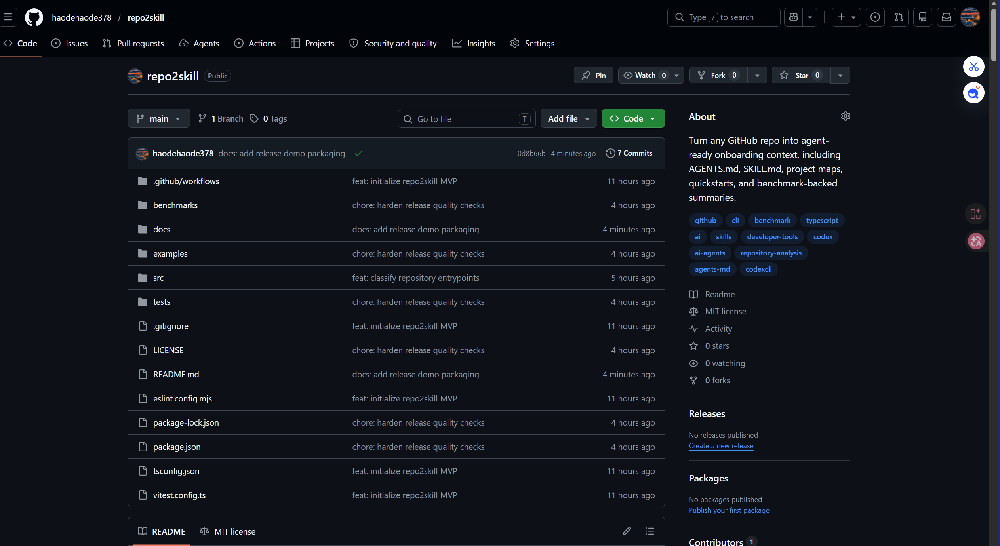

# repo2skill

> Generate evidence-backed `AGENTS.md` and `SKILL.md` files from real repository signals.
>
> 从真实仓库证据生成可追溯的 `AGENTS.md` 和 `SKILL.md`。


[](https://www.typescriptlang.org/)
[](./LICENSE)

**Language / 语言:** [简体中文](#简体中文) | [English](#english)

`repo2skill` turns a local repository or public GitHub repository into agent-ready onboarding context. It is built for coding agents that need grounded instructions, not a loose project summary.

`repo2skill` 会把本地仓库或公开 GitHub 仓库转换成 coding agent 可直接使用的 onboarding 上下文。它不是泛泛总结项目，而是基于真实证据生成可执行、可审查的 agent 工作材料。

```bash
git clone https://github.com/haodehaode378/repo2skill.git
cd repo2skill
npm install
npm run dev -- https://github.com/tinylibs/tinybench --no-cache --out ./out-tinybench
```

```txt
Input repository
  -> repo2skill.json
  -> project-map.md
  -> AGENTS.md
  -> SKILL.md
  -> quickstart.windows.md / quickstart.macos.md / quickstart.linux.md
  -> report.html
```

[View tinybench demo](./docs/demo-tinybench.md) | [Before / After](./docs/before-after.md) | [Competitive positioning](./docs/competitive-positioning.md) | [Security model](./docs/security-model.md) | [Release checklist](./docs/release-checklist.md)



---

## 简体中文

`repo2skill` 会分析本地仓库或公开 GitHub 仓库，把仓库里的真实信号转换成 agent-ready onboarding 产物：命令、入口文件、关键配置、重要目录、环境变量线索、验证步骤、`AGENTS.md`、`SKILL.md`、quickstart 和结构化 JSON 报告。

### 为什么存在

很多 repo summary 只能告诉 agent“这个项目大概是什么”。`repo2skill` 更关心“agent 修改代码前应该看什么、完成前应该跑什么”。

- 生成有证据支撑的 `AGENTS.md`，说明修改前导航和完成前验证。
- 生成仓库专属 `SKILL.md`，保留源码入口、发布入口、配置文件和验证命令。
- 所有 JSON、Markdown、HTML 产物来自同一个分析对象，减少文档漂移。
- 通过 benchmark 和 evaluation fixture 保护仓库分析质量。

### 快速开始

优先从源码运行。公开 npm registry 上的 `repo2skill` 包名已经被其他项目占用，并且指向不同仓库；在本项目拿到可控包名和发布方案前，不建议默认使用 `npx repo2skill`。

```bash
git clone https://github.com/haodehaode378/repo2skill.git
cd repo2skill
npm install
npm run dev -- ./tests/fixtures/analysis-target --out ./out
```

分析公开 GitHub 仓库：

```bash
npm run dev -- https://github.com/tinylibs/tinybench --no-cache --out ./out-tinybench
```

只打印摘要，不写入文件：

```bash
npm run dev -- ./tests/fixtures/analysis-target --summary-only
```

生成产物前先运行 audit-only 雏形：

```bash
npm run dev -- https://github.com/tinylibs/tinybench --no-cache --audit-only
```

### npm 状态

当前 `package.json` 声明：

- package name: `repo2skill`;
- CLI bin: `repo2skill -> dist/index.js`;
- publish files: `dist`, `README.md`, `LICENSE`。

但公开 npm 名称 `repo2skill` 已经被其他包占用。因此当前 README 优先推荐源码运行。如果后续改用已控制的包名，预期 npm 运行方式是：

```bash
npx <owned-package-name> https://github.com/tinylibs/tinybench --out ./out-tinybench
```

### 生成产物

| 文件                    | 用途                                     |
| ----------------------- | ---------------------------------------- |
| `repo2skill.json`       | 供工具链继续处理的结构化分析结果         |
| `project-map.md`        | 简洁仓库地图                             |
| `AGENTS.md`             | 给 coding agent 的仓库级工作说明         |
| `SKILL.md`              | 可复制到 agent 会话中的仓库专属 skill    |
| `quickstart.windows.md` | Windows 快速开始                         |
| `quickstart.macos.md`   | macOS 快速开始                           |
| `quickstart.linux.md`   | Linux 快速开始                           |
| `report.html`           | 使用 `--format all` 时生成的 HTML report |

`AGENTS.md` 会给出清晰的修改前导航和验证指令：

```md
## Before Changing Code

- Review relevant config first: `package.json`, `vitest.config.ts`.
- Start from evidenced directories: `src`.

## Validation Before Finishing

- Run only the evidenced validation commands that are relevant to your change.
- Run `pnpm test` for the `test` command.
```

`SKILL.md` 会保留证据来源，包括源码入口和发布产物入口的区别：

```md
## References

- Config: `vitest.config.ts` (test, high)
- Entrypoint: `./dist/index.js` (package-output, high, main)
- Entrypoint: `src/index.ts` (source, medium)
- Directory: `src` (source, medium)
```

完整示例见 [examples/analysis-target](./examples/analysis-target)。

### 当前可检测内容

- 从 lockfile 检测包管理器。
- 从框架配置、依赖和 CLI 信号检测项目类型。
- 从 `package.json` scripts 提取命令，并渲染为 `pnpm test` 或 `npm run build` 等可执行命令。
- 识别 `source`、`package-output`、`cli`、`generated` 等入口角色。
- 检测 `pnpm-workspace.yaml`、`package.json workspaces`、`turbo.json`、`nx.json` 等 workspace 信号。
- 根据源码入口和 workspace globs 推导重要目录，不把 `dist` 当作优先导航目录。
- 检测 `tsconfig`、Vite、Next.js、ESLint、Prettier、Vitest、GitHub Actions、Dockerfile 等关键配置。
- 从 `.env.example`、`.env.local.example` 和 `process.env.*` 用法提取环境变量线索。
- `--audit-only` 可提示 lifecycle scripts、workflows、env files、AI instruction files 和疑似 secrets。

### 常用命令

分析指定 GitHub 分支：

```bash
npm run dev -- https://github.com/octocat/Hello-World --branch master --out ./out-github
```

刷新缓存后分析：

```bash
npm run dev -- https://github.com/octocat/Hello-World --refresh --out ./out-github
```

使用临时 clone，分析后删除：

```bash
npm run dev -- https://github.com/octocat/Hello-World --no-cache --out ./out-github
```

运行 benchmark manifest：

```bash
npm run benchmark -- ./benchmarks/public-node-ts-smoke.json --cache-dir E:/r2s-cache --out ./benchmark-smoke-out
```

运行产物级上下文评估：

```bash
npm run evaluate -- ./evaluations/tinybench.json --cache-dir E:/r2s-cache --out ./evaluation-out
```

### 开发验证

```bash
npm run format:check
npm run lint
npm run typecheck
npm test
npm run build
```

发布 PR 前可运行 `npm run format`。

### 当前范围

已支持：

- 本地仓库和公开 GitHub 仓库。
- 以 Node.js / TypeScript 为主的项目。
- `json`、`md`、`all` 导出模式。
- GitHub clone 缓存、`--refresh`、`--no-cache`。
- smoke/full benchmark baseline 和 regression comparison。

暂不支持：

- 私有仓库鉴权。
- 广泛多语言仓库的深度语义分析。
- 针对不可信仓库的完整 sandbox 或 malware detection。

[Back to top](#repo2skill)

---

## English

`repo2skill` analyzes a local repository or public GitHub repository and turns real repository signals into agent-ready onboarding artifacts: commands, entrypoints, key config files, important directories, environment-variable hints, validation steps, `AGENTS.md`, `SKILL.md`, quickstarts, and a structured JSON report.

### Why It Exists

Most repository summaries tell an agent what a project appears to be. `repo2skill` focuses on what an agent can safely act on:

- evidence-backed `AGENTS.md` instructions for where to look before editing and what to run before finishing;
- repository-specific `SKILL.md` references that preserve source files, package entrypoints, config files, and validation commands;
- repeatable JSON/Markdown/HTML artifacts derived from the same analysis object;
- benchmark and evaluation fixtures that make regressions visible.

### Quick Start

Run from source first. The `repo2skill` npm package name already exists on the public registry and points to a different repository, so this repo does not recommend `npx repo2skill` until publication happens under a controlled package name and bin plan.

```bash
git clone https://github.com/haodehaode378/repo2skill.git
cd repo2skill
npm install
npm run dev -- ./tests/fixtures/analysis-target --out ./out
```

Analyze a public GitHub repository:

```bash
npm run dev -- https://github.com/tinylibs/tinybench --no-cache --out ./out-tinybench
```

Print a summary without writing files:

```bash
npm run dev -- ./tests/fixtures/analysis-target --summary-only
```

Run the audit-only skeleton before generating artifacts:

```bash
npm run dev -- https://github.com/tinylibs/tinybench --no-cache --audit-only
```

### npm Status

`package.json` currently declares:

- package name: `repo2skill`;
- CLI bin: `repo2skill -> dist/index.js`;
- publish files: `dist`, `README.md`, `LICENSE`.

The public npm name `repo2skill` is already occupied by another package. Until this project is published under an owned name, prefer source usage. If the package name is later secured or renamed, the intended package flow is:

```bash
npx <owned-package-name> https://github.com/tinylibs/tinybench --out ./out-tinybench
```

### Generated Artifacts

| File                    | Purpose                                                   |
| ----------------------- | --------------------------------------------------------- |
| `repo2skill.json`       | Structured analysis for downstream tooling                |
| `project-map.md`        | Concise repository map                                    |
| `AGENTS.md`             | Repository-level instructions for coding agents           |
| `SKILL.md`              | Repository skill that can be copied into an agent session |
| `quickstart.windows.md` | Windows quickstart                                        |
| `quickstart.macos.md`   | macOS quickstart                                          |
| `quickstart.linux.md`   | Linux quickstart                                          |
| `report.html`           | HTML report generated with `--format all`                 |

`AGENTS.md` gives clear pre-change navigation and validation guidance:

```md
## Before Changing Code

- Review relevant config first: `package.json`, `vitest.config.ts`.
- Start from evidenced directories: `src`.

## Validation Before Finishing

- Run only the evidenced validation commands that are relevant to your change.
- Run `pnpm test` for the `test` command.
```

`SKILL.md` preserves evidence, including the difference between source entrypoints and package output entrypoints:

```md
## References

- Config: `vitest.config.ts` (test, high)
- Entrypoint: `./dist/index.js` (package-output, high, main)
- Entrypoint: `src/index.ts` (source, medium)
- Directory: `src` (source, medium)
```

See [examples/analysis-target](./examples/analysis-target) for committed sample output.

### What It Detects Today

- Package manager from lockfiles.
- Project type from framework config, dependencies, and CLI signals.
- Commands from `package.json` scripts, rendered as executable commands such as `pnpm test` or `npm run build`.
- Entrypoints with roles such as `source`, `package-output`, `cli`, and `generated`.
- Workspace signals such as `pnpm-workspace.yaml`, `package.json workspaces`, `turbo.json`, and `nx.json`.
- Important directories from source entrypoints and workspace globs, without treating `dist` as a priority navigation target.
- Key config files such as `tsconfig`, Vite, Next.js, ESLint, Prettier, Vitest, GitHub Actions, and Dockerfile.
- Environment variables from `.env.example`, `.env.local.example`, and `process.env.*` usage.
- Audit-only hints for lifecycle scripts, workflows, env files, AI instruction files, and suspected secrets.

### Common Commands

Analyze a specific GitHub branch:

```bash
npm run dev -- https://github.com/octocat/Hello-World --branch master --out ./out-github
```

Refresh the cache before analysis:

```bash
npm run dev -- https://github.com/octocat/Hello-World --refresh --out ./out-github
```

Use a temporary clone that is deleted after analysis:

```bash
npm run dev -- https://github.com/octocat/Hello-World --no-cache --out ./out-github
```

Run the benchmark manifest:

```bash
npm run benchmark -- ./benchmarks/public-node-ts-smoke.json --cache-dir E:/r2s-cache --out ./benchmark-smoke-out
```

Artifact-level context evaluation:

```bash
npm run evaluate -- ./evaluations/tinybench.json --cache-dir E:/r2s-cache --out ./evaluation-out
```

### Development

```bash
npm run format:check
npm run lint
npm run typecheck
npm test
npm run build
```

Use `npm run format` before opening a release PR.

### Current Scope

Supported now:

- Local repositories and public GitHub repositories.
- Node.js / TypeScript-oriented projects.
- `json`, `md`, and `all` export modes.
- GitHub clone cache, `--refresh`, and `--no-cache`.
- Smoke/full benchmark baselines and regression comparison.

Not implemented yet:

- Private repository authentication.
- Deep semantic analysis for broad multi-language repositories.
- Full sandboxing or malware detection for untrusted repositories.

[Back to top](#repo2skill)
